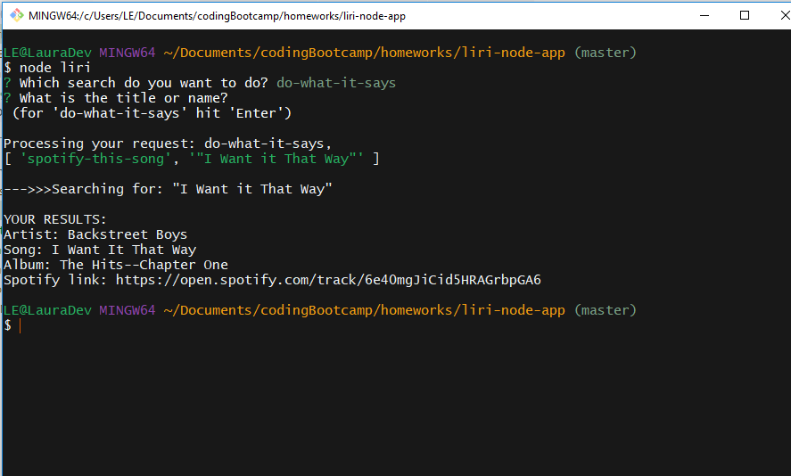

# liri-node-app
LIRI stands for Language Interpretation and Recognition Interface. 

You can use LIRI to:
* **find out about a song**
* **get info about a movie**
* **look up upcoming concerts of your favorite artist**
* **or just receive info about a surprise song**

--------------------------------------------------

### To run LIRI: 
In the command line, from the "liri-node-app" folder, just type "node liri".
> `$ node liri`

This version of LIRI will present you with four options:
>    ? Which search do you want to do? (Use arrow keys)
>    spotify-this-song
>    concert-this
>    movie-this
>    do-what-it-says
>    Use the arrow keys to highlight your choice, then hit "Enter".

Then LIRI will ask you: 
>   ? What is the title or name?
>   (for 'do-what-it-says' hit 'Enter')

After you enter the title or name, you will see the information that you requested!!

----------------------------------------------------

### Required npm packages
These npm packages need to be installed in order to run LIRI:
 axios / dotenv / inquirer / moment / Spotify

Here are the commands to install these packages:
> `$ npm install axios`
> `$ npm install dotenv`
> `$ npm install inquirer`
> `$ npm install moment`
> `$ npm install --save node-spotify-api`

-----------------------------------------------------

### Some screenshots of LIRI in action

#####This is the opening prompt from LIRI:

#####An example of the results for "spotify-this-song":

#####The default song provided if no song title is entered:

#####An example of the results for "concert-this":

#####An example of the results for "movie-this":

#####The default movie provided if no movie title is entered:

#####An example of the results for "do-what-it-says":

